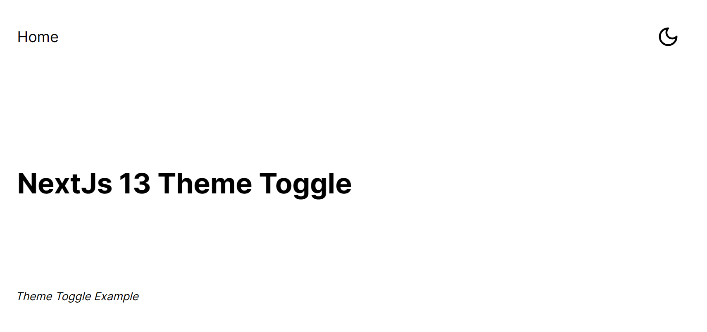
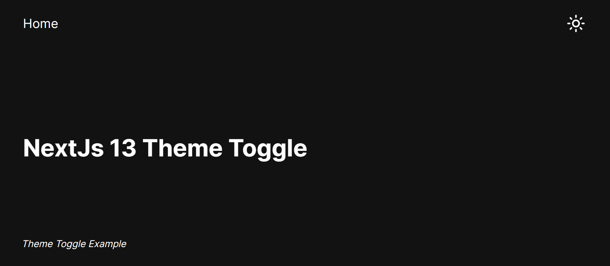

# Implementing Dark Theme in NextJS 13 with TailwindCSS

### In this repo, I create a simple landing page with ```Light``` and ```Dark``` theme enabled

## Quick Setup

1. Create a NextJS app with TailwindCSS.
```console
npx create-next-app@latest next-theme-tut
```
2. Install ```next-themes``` theme package and ```lucide-react``` icon package.
```console
npm i next-themes lucide-react
```
3. Run the dev app
```console
npm run dev
```

4. Customize your Landing page by adding a theme toggle button in the ```nav``` section of the page as in the ```app/layout.js``` and editing the ```app/pages.js``` files.

5. Set up the ```ThemeProvider``` from ```next-themes``` in a ```Providers``` component that will wrap all child components of the app. This will enable all ```children``` gain access to the ```ThemeProvider``` hence theme functionality.<br><br>
Check this implementaion in the ```app/providers.js``` and ```app/components/ThemeButton.js``` files.

6. Watch out for React Hydration error by checking the ```next-themes``` README in npm [here](https://www.npmjs.com/package/next-themes?activeTab=readme) and when to use ```suppressHydrationWarning``` in your app in the NextJS docs [here](https://nextjs.org/docs/messages/react-hydration-error).


## Screenshots

1. Lightmode


2. Darkmode


### Thank you

